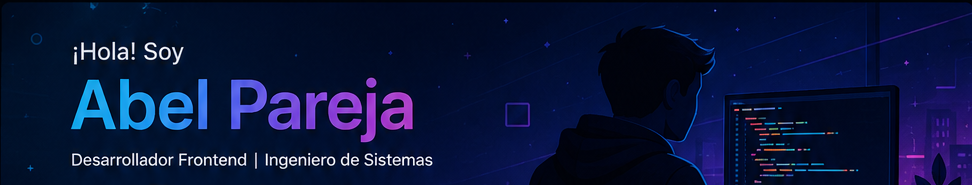

  

Apasionado por construir aplicaciones web modernas, intuitivas y responsivas utilizando React, JavaScript y tecnologías web actuales.

---

# 👨‍💻 Sobre mí

💡 Me apasiona desarrollar aplicaciones web modernas y resolver problemas mediante software.

🌱 Actualmente fortaleciendo mis conocimientos en React, arquitectura frontend, consumo de APIs .

🎨 Interesado en UI/UX, Figma y experiencias de usuario intuitivas.

🚀 Me gusta crear proyectos personales que resuelvan problemas reales.

📚 Siempre aprendiendo nuevas tecnologías y mejores prácticas de desarrollo.

📫 Contacto: **[n.abelpareja@gmail.com](mailto:n.abelpareja@gmail.com)**

---

# 🚀 Proyecto Destacado

## 💰 Gestor de Gastos Personales

Aplicación web desarrollada con React para administrar ingresos y gastos personales.

### Características

* ✅ CRUD completo de movimientos
* ✅ Dashboard financiero
* ✅ Gráficos interactivos con Recharts
* ✅ Filtros por mes y año
* ✅ Persistencia con LocalStorage
* ✅ Diseño responsive con Tailwind CSS

🔗 Proyecto en Netlify: [https://gastosper.netlify.app/reportes]

🔗 Repositorio: [Enlace aquí]

---

# 🛠 Tecnologías y Herramientas

## Frontend

## Base de Datos

## Herramientas

---

# 📊 Lenguajes más utilizados

  

# 🎯 Objetivos Actuales

* 🚀 Conseguir mi primera oportunidad profesional como Frontend Developer.
* 📚 Profundizar en React y arquitectura de aplicaciones.
* ☁️ Aprender despliegue y servicios Cloud.
* 🔧 Desarrollar proyectos Full Stack.
* 🌎 Construir un portafolio sólido.

---

# 🤝 Conecta Conmigo

---

⭐ Gracias por visitar mi perfil.
